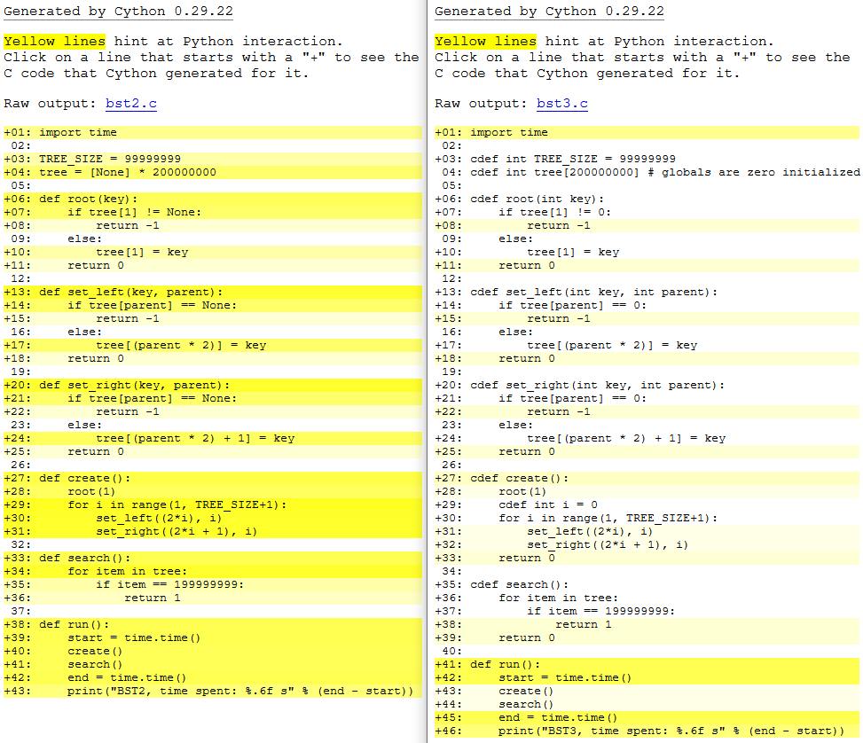

# Cython training

There are five very similar breadth-first binary tree implementations in this directory. The primary goal was to make them as similar as possible. This allows us to compare execution speeds reliably. The code is ugly and you shouldn't concentrate on the look of it. (Basically all implementations are very C-like).

# Building and Running
Cython code is optimized by default. Therefore, we also optimize C/C++.
```
Python:
Can't build (interpreted)

Cython & compiled python:
$ python setup.py build_ext --inplace

C++:
$ g++ -O3 -o bst4 bst4.cpp

C:
$ gcc -O3 -o bst5 bst5.c
```

# Results
Script `run.bash` executes all five different implementations one by one:
- BST1 = Vanilla python
- BST2 = Compiled python
- BST3 = Cython
- BST4 = C++
- BST5 = C

Execution times from five separate runs are listed below.  
**Run1:**
```
BST1, time spent: 50.232464 s
BST2, time spent: 35.712397 s
BST3, time spent: 0.580543 s
BST4, time spent: 0.289777 s
BST5, time spent: 0.157203 s
```
**Run2:**
```
BST1, time spent: 49.363546 s
BST2, time spent: 34.020573 s
BST3, time spent: 0.495247 s
BST4, time spent: 0.276132 s
BST5, time spent: 0.164909 s
```
**Run3:**
```
BST1, time spent: 48.056554 s
BST2, time spent: 32.528199 s
BST3, time spent: 0.549082 s
BST4, time spent: 0.268935 s
BST5, time spent: 0.161112 s
```

**Run4:**
```
BST1, time spent: 50.333851 s
BST2, time spent: 32.341366 s
BST3, time spent: 0.500855 s
BST4, time spent: 0.271668 s
BST5, time spent: 0.152830 s
```
**Run5:**
```
BST1, time spent: 49.326641 s
BST2, time spent: 32.870853 s
BST3, time spent: 0.430167 s
BST4, time spent: 0.277943 s
BST5, time spent: 0.155808 s
```

### Python interactions
The image below visualizes python interaction frequency with compiled python and Cython implementations.


## Misc
Some random considerations:
- Uses hardcoded numbers in initializations, so same amount of memory gets allocated (initializations are similar)
- Indexing starts from 1 for two reasons. We want to reserve zero for 'null' check in C and equations are simpler this way.
- Uses ints, because they are hopefully same between Cython and C/C++.
- Loops through the whole tree to maximize excution time. Results are better this way than they would be with program that doesn't take long to run.
- Info: https://en.wikipedia.org/wiki/Binary_tree#Arrays